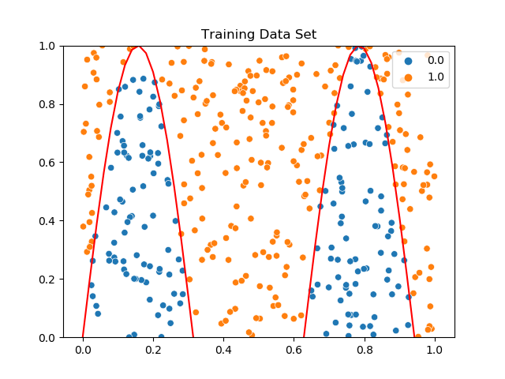
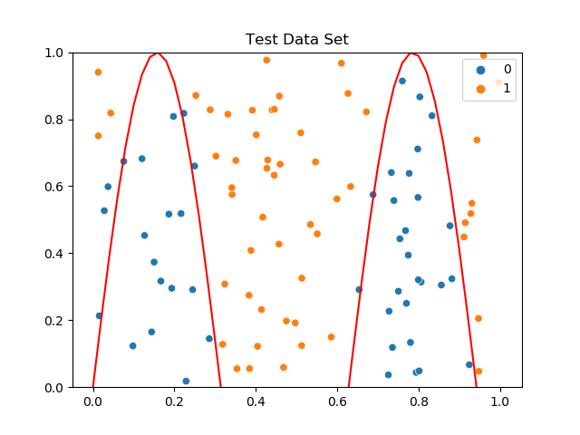

# Function-approximator-with-pytorch
Given any function, the network learns to classify, which points are below the graph of the function and which are above. The implementation is done in PyTorch. As an example consider the function

```python
f(x) = sin(10x)
```
Then we can sample training data like this.


After we verfy our results using different test data for validation.


